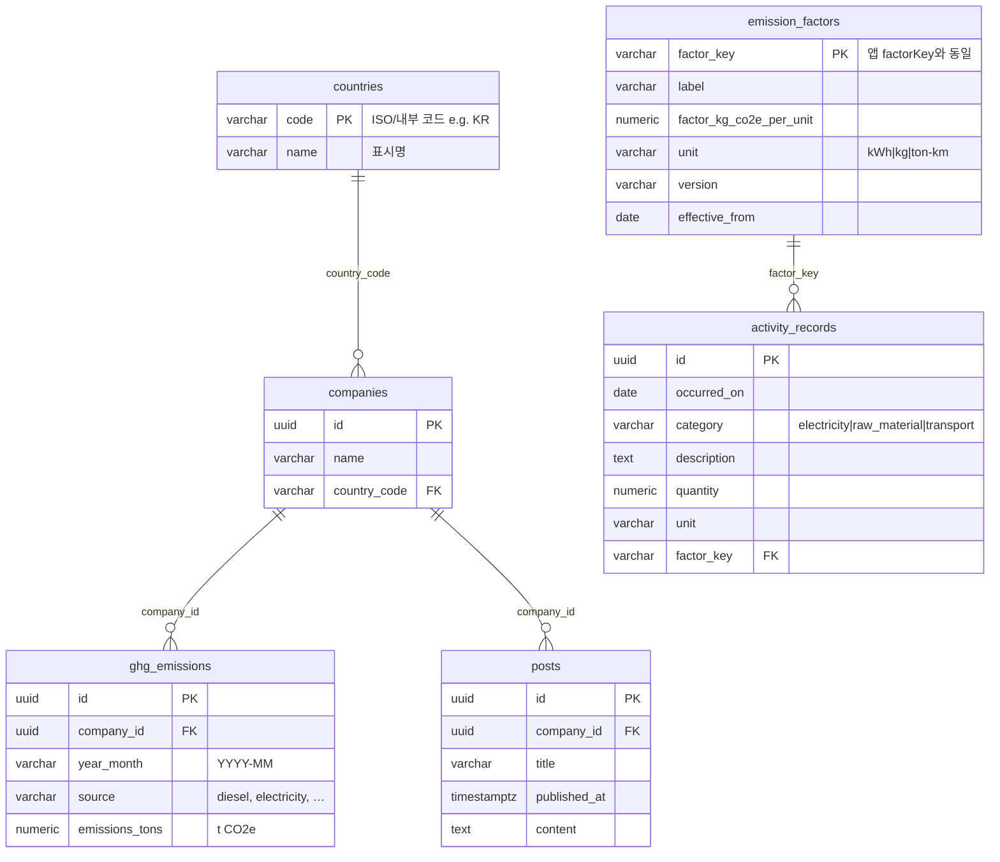

# HanaLoop 탄소 배출 · PCF 대시보드

Next.js 14(App Router) 기반 단일 앱입니다. 경영용 GHG 집계, PCF 활동·배출계수, 게시글을 가짜(in-memory) API로 연결합니다.

# 배포주소
https://pcfdashboard.netlify.app/

## 실행 방법 (5단계)

1. **Node.js** 20 LTS 권장  
2. 저장소에서 **`dashboard`** 폴더로 이동  
3. **`yarn install`**  
4. 개발: **`yarn dev`** → 브라우저에서 [http://localhost:3000](http://localhost:3000)  
5. 배포 검증: **`yarn build`** 후 **`yarn start`**

자동 테스트: **`yarn test`** (Vitest, PCF·검증·게시글 저장 시뮬레이션)

> 첫 화면(`/`)이 경영 대시보드입니다.

## 기술 스택

- React 18, TypeScript, Tailwind CSS v4  
- **recharts** — 경영·PCF 차트  
- **SheetJS (xlsx)** — 활동 데이터 엑셀 임포트  
- **Vitest** — 소수 단위 테스트 (`yarn test`)  

## 라우트·기능

| 경로 | 내용 |
|------|------|
| `/` | 국가·회사 필터, 월별 추이·배출원별 차트, 상세 표 (`fetchCompanies`, `fetchCountries`) |
| `/pcf` | 활동×배출계수 kg CO₂e 산출, 월·유형 차트, 단일 입력·붙여넣기·엑셀 일괄 추가 |
| `/posts` | 게시글 목록·작성·수정, `POST /api/posts` 저장 및 실패 시 재시도 UX |

## 아키텍처 요약

- **데이터**: `src/data/seed.ts` 시드 → `src/lib/api.ts`가 메모리에 보관(서버 프로세스 단위). 새로고침·재시작 시 시드 기준으로 초기화됩니다.  
- **경영 데이터**: 페이지(RSC)에서 `fetch*` 호출 → 클라이언트 대시보드에 props 전달, 필터만 `useState`.  
- **PCF 계산**: `src/lib/pcf.ts`, `src/lib/emissions.ts` 등 순수 함수로 집계.  
- **입력 검증**: `src/lib/activity-validation.ts` — 폼·CSV·엑셀 행 공통 검증.  
- **HTTP**: `src/app/api/posts`, `src/app/api/activities`, `src/app/api/activities/import` — 브라우저는 Route Handler만 호출해 서버 메모리와 일치시킵니다.  
- **레이아웃**: `src/app/(shell)/layout.tsx` → `DashboardShell`(모바일 드로어) + `Sidebar`.

## 데이터 모델

앱 구현은 **메모리(in-memory)** 입니다. 아래는 같은 도메인을 **PostgreSQL**로 옮길 때의 정규화 스키마 기준 **물리 ERD**입니다.

### PostgreSQL 기준 물리 ERD

### 앱 타입과의 대응

| 테이블 | TypeScript / 시드 |
|--------|-------------------|
| `countries` | `Country` |
| `companies` | `Company` (중첩 `emissions`는 행으로 분리) |
| `ghg_emissions` | `GhgEmission` + `company_id` |
| `posts` | `Post` (`resourceUid` → `company_id`) |
| `emission_factors` | `EmissionFactorRecord` |
| `activity_records` | `ActivityRecord` |

## 마무리 품질 (7번)

- **테스트**: `src/lib/*.test.ts` — `computePcfRows`·월 합산·단위 불일치 스킵, `validateCreateActivity` 성공·실패, `createOrUpdatePost` 지연·랜덤 실패 시뮬레이션(`Math.random` + fake timers). 실행: `yarn test` / 감시: `yarn test:watch`
- **반응형**: `DashboardShell` 드로어·`min-w-0` 그리드 등 기존 레이아웃 유지, 제출 전 실제 폭에서 표·차트 스크롤 확인 권장
- **접근성**: 쉘 상단에 **본문으로 건너뛰기** 링크(`#main-content`), 폼·차트·내비에 라벨/`aria-*` 사용
- **커밋**: 과제에서 요구 시 기능 단위로 나누어 커밋(예: `feat(dashboard): …`, `test: …`, `fix: …`)

## AI 사용 내역

### 사용 도구·환경

| 항목 | 내용 |
|------|------|
| IDE / 에이전트 | Cursor(채팅·코드 에이전트, 인라인 편집) |
| 모델 | Cursor에 내장·라우팅되는 LLM(대화 시점별 모델은 Cursor 정책에 따름) |
| 보조 | 자동 완성·린트 표시·터미널 명령 실행 제안 등 |

### 활용한 작업 유형

| 단계 | AI에 맡긴 일 | 산출물 |
|------|-------------------|--------|
| 구조·라우팅 | `(shell)` 그룹, 사이드바·드로어 레이아웃, `/`를 대시보드로 두는 흐름 제안 | `DashboardShell`, `Sidebar`, `app/(shell)` |
| 경영 대시보드 | `recharts` 기반 차트·필터·집계 유틸 초안, `Tooltip` 타입 오류 대응 패턴 | `EmissionsDashboard`, `emissions.ts` |
| PCF | 활동×배출계수 합산 모듈, 월·유형 차트, 입력 패널(단일/붙여넣기/엑셀) | `pcf.ts`, `PcfDashboard`, `PcfActivityInputPanel` |
| 검증·임포트 | `activity-validation`, 엑셀 파싱(`xlsx`), API 라우트와의 연동 | `activity-validation.ts`, `excel-import.ts`, `api/activities/*` |
| 버그·동작 이슈 | 엑셀 날짜가 하루 밀리는 문제 → `cellDates`/`parse_date_code` 경로 정리 | `excel-import.ts`, `normalizeOccurredOn` 보강 |
| React 패턴 | `useEffect` 내 `setState` 린트 이슈 → 파생 값(`resolvedFactorKey`)으로 대체 | `PcfActivityInputPanel.tsx` |
| 문서 | README 실행 방법, PostgreSQL 스키마·ERD·DDL 스케치 초안 | 본 `README.md` |

### 한 일

- 생성 코드 읽고 프로젝트 스타일·과제 범위에 맞게 수정·통합
- 린트로 깨지는 부분을 직접 고치고, 화면에서 입력·필터·저장·에러 UX를 확인
- 시드 데이터·도메인 규칙(배출계수 키, 단위, 카테고리)은 과제 pdf 을 기준으로 최종 판단

### 검증 방법

| 방법 | 내용 |
|------|------|
| 빌드 | `yarn build`로 타입·린트·정적 페이지 생성 통과 확인 |
| 단위 테스트 | `yarn test`로 PCF·입력 검증·게시글 저장 시뮬레이션 |
| 실행 | `yarn dev` / `yarn start`로 `/`, `/pcf`, `/posts` 동작 확인 |
| 시나리오 | 필터 변경, PCF 단일·일괄 입력, 게시글 저장·실패·재시도, 모바일 메뉴 등 |

---

