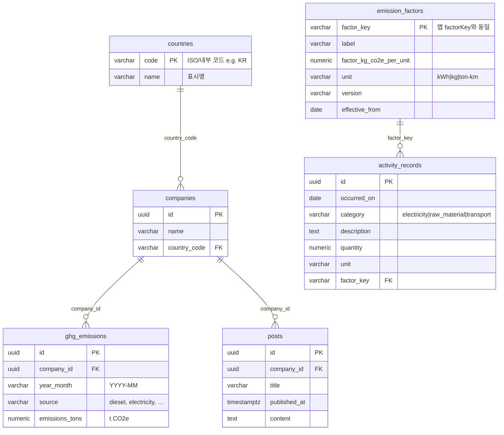

# HanaLoop 탄소 배출 · PCF 대시보드

Next.js 14(App Router) 기반 단일 앱입니다. 경영용 GHG 집계, PCF 활동·배출계수, 게시글을 가짜(in-memory) API로 연결합니다.

## 실행 방법 (5단계)

1. **Node.js** 20 LTS 권장  
2. 저장소에서 **`dashboard`** 폴더로 이동  
3. **`yarn install`**  
4. 개발: **`yarn dev`** → 브라우저에서 [http://localhost:3000](http://localhost:3000)  
5. 배포 검증: **`yarn build`** 후 **`yarn start`**

> 첫 화면(`/`)이 곧 경영 대시보드입니다. `/dashboard`는 `/`로 리다이렉트됩니다.

## 기술 스택

- React 18, TypeScript, Tailwind CSS v4  
- **recharts** — 경영·PCF 차트  
- **SheetJS (xlsx)** — 활동 데이터 엑셀 임포트  

## 라우트·기능

| 경로 | 내용 |
|------|------|
| `/` | 국가·회사 필터, 월별 추이·배출원별 차트, 상세 표 (`fetchCompanies`, `fetchCountries`) |
| `/pcf` | 활동×배출계수 kg CO₂e 산출, 월·유형 차트, 단일 입력·붙여넣기·엑셀 일괄 추가 |
| `/posts` | 게시글 목록·작성·수정, `POST /api/posts` 저장 및 실패 시 재시도 UX |

## 아키텍처 요약

- **데이터**: `src/data/seed.ts` 시드 → `src/lib/api.ts`가 메모리에 보관(서버 프로세스 단위). 새로고침·재시작 시 시드 기준으로 초기화됩니다.  
- **경영 데이터**: 페이지(RSC)에서 `fetch*` 호출 → 클라이언트 대시보드에 props 전달, 필터만 `useState`.  
- **PCF 계산**: `src/lib/pcf.ts`, `src/lib/emissions.ts` 등 순수 함수로 집계.  
- **입력 검증**: `src/lib/activity-validation.ts` — 폼·CSV·엑셀 행 공통 검증.  
- **HTTP**: `src/app/api/posts`, `src/app/api/activities`, `src/app/api/activities/import` — 브라우저는 Route Handler만 호출해 서버 메모리와 일치시킵니다.  
- **레이아웃**: `src/app/(shell)/layout.tsx` → `DashboardShell`(모바일 드로어) + `Sidebar`.

## 데이터 모델

앱 구현은 **메모리(in-memory)** 입니다. 아래는 같은 도메인을 **PostgreSQL**로 옮길 때의 정규화 스키마 기준 **물리 ERD**입니다.

### PostgreSQL 기준 물리 ERD



### 앱 타입과의 대응

| 테이블 | TypeScript / 시드 |
|--------|-------------------|
| `countries` | `Country` |
| `companies` | `Company` (중첩 `emissions`는 행으로 분리) |
| `ghg_emissions` | `GhgEmission` + `company_id` |
| `posts` | `Post` (`resourceUid` → `company_id`) |
| `emission_factors` | `EmissionFactorRecord` |
| `activity_records` | `ActivityRecord` |

### DDL 스케치 (참고)

```sql
CREATE TABLE countries (
  code VARCHAR(8) PRIMARY KEY,
  name VARCHAR(128) NOT NULL
);

CREATE TABLE companies (
  id UUID PRIMARY KEY,
  name VARCHAR(256) NOT NULL,
  country_code VARCHAR(8) NOT NULL REFERENCES countries (code)
);

CREATE TABLE ghg_emissions (
  id UUID PRIMARY KEY,
  company_id UUID NOT NULL REFERENCES companies (id) ON DELETE CASCADE,
  year_month VARCHAR(7) NOT NULL,
  source VARCHAR(64) NOT NULL,
  emissions_tons NUMERIC(18, 6) NOT NULL,
  UNIQUE (company_id, year_month, source)
);

CREATE TABLE posts (
  id UUID PRIMARY KEY,
  company_id UUID NOT NULL REFERENCES companies (id) ON DELETE CASCADE,
  title VARCHAR(512) NOT NULL,
  published_at TIMESTAMPTZ NOT NULL,
  content TEXT NOT NULL
);

CREATE TABLE emission_factors (
  factor_key VARCHAR(64) PRIMARY KEY,
  label VARCHAR(256) NOT NULL,
  factor_kg_co2e_per_unit NUMERIC(24, 12) NOT NULL,
  unit VARCHAR(16) NOT NULL,
  version VARCHAR(32) NOT NULL,
  effective_from DATE NOT NULL
);

CREATE TABLE activity_records (
  id UUID PRIMARY KEY,
  occurred_on DATE NOT NULL,
  category VARCHAR(32) NOT NULL,
  description TEXT NOT NULL,
  quantity NUMERIC(24, 8) NOT NULL,
  unit VARCHAR(16) NOT NULL,
  factor_key VARCHAR(64) NOT NULL REFERENCES emission_factors (factor_key)
);
CREATE INDEX idx_activity_occurred ON activity_records (occurred_on);
CREATE INDEX idx_ghg_company_month ON ghg_emissions (company_id, year_month);
```

## AI 사용 내역


| 구분 | 내용 |
|------|------|
| 사용 도구 | Cursor |
| 활용 범위 | 라우트 구조 제안, Recharts 타입 오류 수정, 엑셀 날짜 TZ 이슈 조사 |
| 검증 | `yarn build`, 주요 화면 수동 테스트 |
| 비고 | 생성 코드는 리뷰·수정 후 반영 |

---

